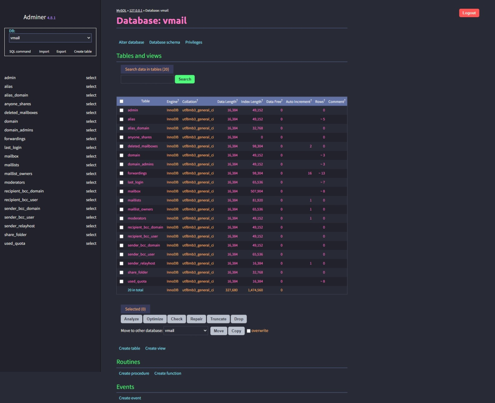

# Dracula for [Adminer](https://www.adminer.org/)

> A dark theme for [Adminer](https://www.adminer.org/).

## Install

All instructions can be found at [draculatheme.com/adminer](https://draculatheme.com/adminer).

## Team

This theme is maintained by the following person(s) and a bunch of [awesome contributors](https://github.com/dracula/adminer/graphs/contributors).

| |
|--- |
|[Douglas Damasio](https://github.com/douglasdamasio) |

## Community

* [Twitter](https://twitter.com/draculatheme) - Best for getting updates about themes and new stuff.
* [GitHub](https://github.com/dracula/dracula-theme/discussions) - Best for asking questions and discussing issues.
* [Discord](https://draculatheme.com/discord-invite) - Best for hanging out with the community.

## License

[MIT License](./LICENSE)
